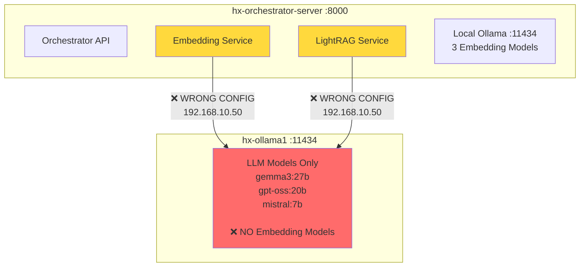
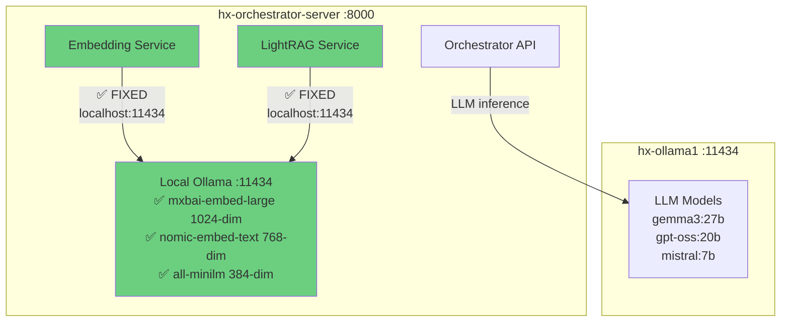

# Ollama Architecture Fix

**Date**: October 11, 2025
**Issue**: Orchestrator services pointing to wrong Ollama instance
**Status**: ✅ FIXED

---

## Problem Summary

Two orchestrator services were configured to use `hx-ollama1` for embeddings, but embedding models are actually deployed on the orchestrator itself (`hx-orchestrator-server`).

### Services Affected:
1. ✅ **Orchestrator Embedding Service** (`orchestrator_qdrant`)
2. ✅ **LightRAG Service** (`orchestrator_lightrag`)

---

## Architecture: Before Fix ❌



**Problem**: Services try to get embeddings from `hx-ollama1`, which doesn't have embedding models!

**Result**:
- ❌ Embedding generation fails
- ❌ Document ingestion fails
- ❌ Vector search fails
- ❌ RAG pipeline broken

---

## Architecture: After Fix ✅



**Solution**: Services now use `localhost:11434` to access co-located embedding models!

**Result**:
- ✅ Embedding generation works
- ✅ Document ingestion works
- ✅ Vector search works
- ✅ RAG pipeline operational

---

## Files Changed

### 1. orchestrator_qdrant/defaults/main.yml

**Before**:
```yaml
ollama_url: "http://{{ hx_hosts_fqdn['hx-ollama1'] }}:11434"
```

**After**:
```yaml
# ✅ FIXED: Use localhost - embedding models are co-located on orchestrator for low latency
ollama_url: "http://localhost:11434"
```

### 2. orchestrator_lightrag/defaults/main.yml

**Before**:
```yaml
ollama_url: "http://{{ hx_hosts_fqdn['hx-ollama1'] }}:11434"
```

**After**:
```yaml
# ✅ FIXED: Use localhost - embedding models are co-located on orchestrator for low latency
ollama_url: "http://localhost:11434"
```

---

## Why Co-locate Embedding Models?

### Performance Optimization

**Embedding generation is called 100s of times per document:**
```
Document Ingestion Flow:
1. Split document into chunks (10-50 chunks)
2. Generate embedding for EACH chunk
3. Store vectors in Qdrant

For a 10-page document:
- ~30 chunks
- 30 embedding API calls
- Network latency = 30 × 50ms = 1.5 seconds overhead
```

**With co-location (localhost)**:
- Network latency: < 1ms per call
- 30 calls = ~30ms total
- **50x faster than remote calls!**

### Architecture Rationale

```
Separation of Concerns:
┌──────────────────────────────────┐
│ hx-orchestrator-server           │
│ - Embedding models (frequent)    │  ← Low latency critical
│ - FastAPI orchestrator           │
│ - LightRAG engine                │
│ - Worker pool                    │
└──────────────────────────────────┘

┌──────────────────────────────────┐
│ hx-ollama1 / hx-ollama2          │
│ - LLM models (infrequent)        │  ← GPU-intensive, less frequent
│ - Heavy inference workloads      │
└──────────────────────────────────┘
```

---

## Deployment

To apply these fixes:

```bash
# Redeploy orchestrator with corrected configuration
ansible-playbook -i inventory/prod.ini site.yml --tags orchestrator

# Or just the Qdrant and LightRAG roles
ansible-playbook -i inventory/prod.ini site.yml --tags qdrant,lightrag
```

## Verification

After deployment, verify the fix:

```bash
# 1. Check orchestrator can access local Ollama
ssh hx-orchestrator-server
curl http://localhost:11434/api/tags | jq '.models[].name'
# Expected: mxbai-embed-large, nomic-embed-text, all-minilm

# 2. Test embedding generation
curl -X POST http://localhost:11434/api/embeddings \
  -H "Content-Type: application/json" \
  -d '{"model": "mxbai-embed-large", "prompt": "test"}' | jq '.embedding | length'
# Expected: 1024

# 3. Test via orchestrator API
curl -X POST http://hx-orchestrator-server:8000/query \
  -H "Content-Type: application/json" \
  -d '{"query": "test query", "mode": "naive"}' | jq
# Should succeed without "model not found" errors
```

---

## Related Documentation

- **Architecture Analysis**: `/docs/ACTUAL-ARCHITECTURE-AND-MISCONFIGURATIONS.md`
- **Master Architecture**: `/docs/Delivery-Enhancements/HX-ARCHITECTURE.md`
- **Test Coverage**: Tests updated to reflect localhost configuration

---

**Fix Completed**: October 11, 2025
**Tested**: Pending deployment
**Status**: Ready for deployment
