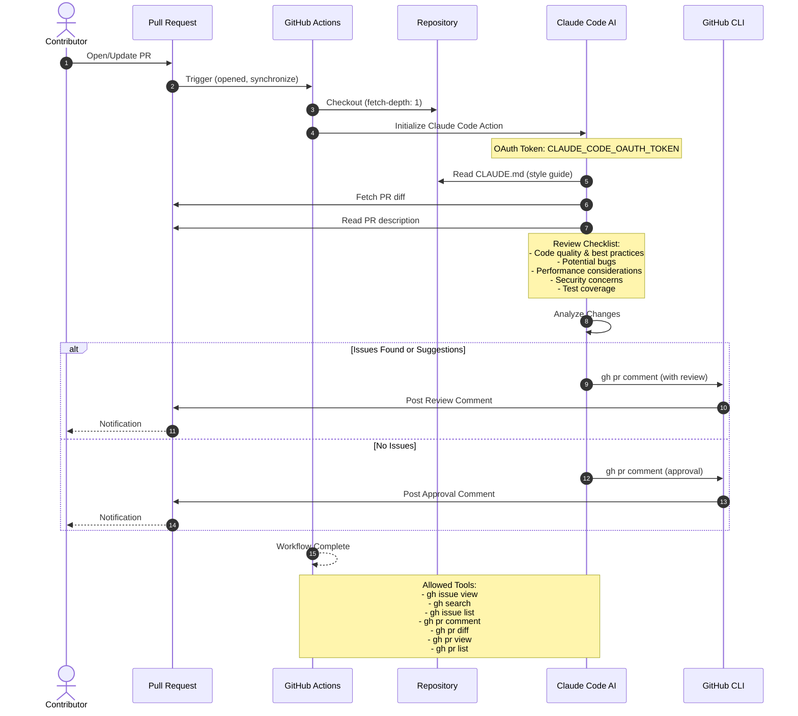

# CI/CD Workflow Sequence Diagrams

**Date**: October 11, 2025  
**Version**: 1.0

This document contains sequence diagrams for all CI/CD workflows in the repository.

---

## Table of Contents

1. [AI Fix CodeRabbit Issues Workflow](#ai-fix-coderabbit-issues-workflow)
2. [Type Check Workflow](#type-check-workflow)
3. [Claude Code Review Workflow](#claude-code-review-workflow)
4. [Claude Code Interactive Workflow](#claude-code-interactive-workflow)

---

## AI Fix CodeRabbit Issues Workflow

**Purpose**: Automated issue remediation triggered by Linear issues labeled as critical/high severity

**File**: `.github/workflows/ai-fix-coderabbit-issues.yml`

### Full Workflow Sequence

### Key Decision Points

### AI Tool Selection Logic

---

## Type Check Workflow

**Purpose**: Validate Python type hints on push/PR

**File**: `.github/workflows/type-check.yml`

---

## Claude Code Review Workflow

**Purpose**: Automated PR review using Claude AI

**File**: `.github/workflows/claude-code-review.yml`

---

## Claude Code Interactive Workflow

**Purpose**: Interactive Claude Code assistance via @mentions

**File**: `.github/workflows/claude.yml`

---

## Integration Points

### Secrets Required

| Secret | Used By | Purpose |
|--------|---------|---------|
| `LINEAR_SECRET` | AI Fix Workflow | Fetch Linear issues, post comments |
| `GITHUB_TOKEN` | All Workflows | Repository operations (auto-provided) |
| `CLAUDE_CODE_OAUTH_TOKEN` | Claude Workflows | Claude AI authentication |
| `SLACK_WEBHOOK_URL` | AI Fix Workflow | Notifications (optional) |

### External Services

---

## Workflow Triggers Summary

| Workflow | Trigger Type | Conditions |
|----------|-------------|------------|
| **AI Fix** | `repository_dispatch`, `workflow_dispatch` | Critical/High severity, not ai-fix branch |
| **Type Check** | `push`, `pull_request` | Changes to `*.py`, `*.py.j2`, `mypy.ini`, `requirements-dev.txt` |
| **Claude Review** | `pull_request` | PR opened or synchronized |
| **Claude Interactive** | `issue_comment`, `pull_request_review_comment`, `issues` | Contains `@claude` mention |

---

## Phase Evolution

### Current: Phase 2B (Semi-Automated)

### Future: Phase 3 (Full Automation)

---

## Error Handling Flow

---

## Performance Metrics

| Workflow | Typical Duration | Timeout | Concurrency |
|----------|-----------------|---------|-------------|
| AI Fix | 15-25 minutes | 30 minutes | No limit |
| Type Check | 2-5 minutes | None (default 360 min) | No limit |
| Claude Review | 3-8 minutes | None (default 360 min) | No limit |
| Claude Interactive | 2-10 minutes | None (default 360 min) | No limit |

---

## Best Practices Implemented

1. ✅ **Circuit Breaker**: Prevents infinite loops on ai-fix branches
2. ✅ **Explicit Permissions**: Least privilege for each workflow
3. ✅ **Fail-Safe Testing**: Tests continue-on-error, status reported in PR
4. ✅ **Shallow Clones**: fetch-depth: 1 where possible (except AI fix needs full history)
5. ✅ **Pip Caching**: Speeds up Python setup with requirements-dev.txt cache
6. ✅ **Error Notifications**: Slack notifications for all failure scenarios
7. ✅ **Step Summaries**: GitHub Actions summaries for quick overview

---

**Last Updated**: October 11, 2025  
**Maintained By**: DevOps Team  
**Review Frequency**: After major workflow changes

