# HX-Citadel Fleet FQDN Documentation Analysis

**Date**: October 12, 2025  
**Analyst**: DeepAgent  
**Status**: Comprehensive Review Complete  
**Domain**: `dev-test.hana-x.ai`

---

## Executive Summary

The `docs/fqdn` directory contains comprehensive FQDN policy documentation, enforcement tooling, and remediation reports for the HX-Citadel fleet. The documentation demonstrates a mature approach to infrastructure management with automated policy enforcement and complete remediation tracking.

**Key Findings:**
- ✅ **17 hosts** in the fleet, all properly mapped to FQDNs
- ✅ **Zero violations** in production roles after remediation
- ✅ **Automated enforcement** via pre-commit hooks and Ansible guardrails
- ✅ **Complete audit trail** from violation detection to remediation
- ⚠️ **Documentation may be outdated** compared to current playbooks (as noted by user)

---

## Fleet Architecture Overview

### Domain Structure


---

## Fleet Inventory

### Complete Host Mapping

| Short Name | FQDN | IP Address | Role/Purpose |
|------------|------|------------|--------------|
| hx-dc-server | hx-dc-server.dev-test.hana-x.ai | 192.168.10.2 | Domain Controller, DNS |
| hx-ca-server | hx-ca-server.dev-test.hana-x.ai | 192.168.10.4 | Certificate Authority |
| hx-orchestrator-server | hx-orchestrator-server.dev-test.hana-x.ai | 192.168.10.8 | FastAPI Orchestrator |
| hx-vectordb-server | hx-vectordb-server.dev-test.hana-x.ai | 192.168.10.9 | Qdrant Vector Database |
| hx-webui-server | hx-webui-server.dev-test.hana-x.ai | 192.168.10.11 | Primary Web UI |
| hx-dev-server | hx-dev-server.dev-test.hana-x.ai | 192.168.10.12 | Development Environment |
| hx-test-server | hx-test-server.dev-test.hana-x.ai | 192.168.10.13 | Testing Environment |
| hx-devops-server | hx-devops-server.dev-test.hana-x.ai | 192.168.10.14 | DevOps Tooling |
| hx-metrics-server | hx-metrics-server.dev-test.hana-x.ai | 192.168.10.16 | Prometheus/Grafana |
| hx-fs-server | hx-fs-server.dev-test.hana-x.ai | 192.168.10.17 | File Server/NFS |
| hx-litellm-server | hx-litellm-server.dev-test.hana-x.ai | 192.168.10.46 | LiteLLM API Gateway |
| hx-prisma-server | hx-prisma-server.dev-test.hana-x.ai | 192.168.10.47 | Prisma ORM Service |
| hx-sqldb-server | hx-sqldb-server.dev-test.hana-x.ai | 192.168.10.48 | PostgreSQL + Redis |
| hx-ollama1 | hx-ollama1.dev-test.hana-x.ai | 192.168.10.50 | Ollama LLM Instance 1 |
| hx-ollama2 | hx-ollama2.dev-test.hana-x.ai | 192.168.10.52 | Ollama LLM Instance 2 |
| hx-qwebui-server | hx-qwebui-server.dev-test.hana-x.ai | 192.168.10.53 | Qdrant Web UI |
| hx-mcp1-server | hx-mcp1-server.dev-test.hana-x.ai | 192.168.10.59 | MCP Server |

---

## Service Dependencies


---

## FQDN Policy Framework

### Policy Hierarchy

```mermaid
graph TD
    POLICY[FQDN Policy<br/>Universal Instruction]
    
    POLICY --> ENFORCE[Enforcement Layer]
    POLICY --> REMEDIATE[Remediation Layer]
    POLICY --> PREVENT[Prevention Layer]
    
    ENFORCE --> ANSIBLE[Ansible Guardrails<br/>Build-time Checks]
    ENFORCE --> SCANNER[Shell Scanner<br/>scripts/check-fqdn.sh]
    
    REMEDIATE --> AUTO[Auto-fix Tasks<br/>IP → FQDN Mapping]
    REMEDIATE --> MANUAL[Manual Review<br/>Violation Reports]
    
    PREVENT --> PRECOMMIT[Pre-commit Hooks<br/>Git Integration]
    PREVENT --> CI[CI Pipeline<br/>Automated Testing]
    
    style POLICY fill:#ffd700
    style ENFORCE fill:#ff6b6b
    style REMEDIATE fill:#4ecdc4
    style PREVENT fill:#95e1d3
```



### Forbidden Patterns

The policy prohibits the following patterns in production code:

1. **Loopback addresses**:
   - `localhost`
   - `127.0.0.1`
   - `::1`

2. **Raw IP addresses** (fleet subnet):
   - `192.168.10.x` (any host in the fleet subnet)

3. **Exceptions** (allowlisted):
   - Local bind interfaces (Redis, PostgreSQL)
   - Health check scripts (localhost validation)
   - Documentation examples
   - Test fixtures

---

## Remediation Journey

### Timeline


### Violation Breakdown


---

## Technical Implementation

### Variable Structure

The fleet uses a centralized FQDN mapping in `group_vars/all/fqdn_map.yml`:

```yaml
# Domain configuration
hx_domain: dev-test.hana-x.ai
hx_dc_ip: 192.168.10.2

# Short name → FQDN mapping
hx_hosts_fqdn:
  hx-orchestrator-server: hx-orchestrator-server.dev-test.hana-x.ai
  hx-sqldb-server: hx-sqldb-server.dev-test.hana-x.ai
  # ... 15 more hosts

# FQDN → IP mapping (for reporting only)
hx_hosts_ip:
  hx-orchestrator-server.dev-test.hana-x.ai: 192.168.10.8
  # ... 16 more hosts

# IP → FQDN mapping (for auto-remediation)
ip_map:
  "192.168.10.8": hx-orchestrator-server.dev-test.hana-x.ai
  # ... 16 more hosts
```

### Usage Pattern in Templates

**Before (hardcoded IP):**
```yaml
cors_origins:
  - "http://192.168.10.11"
  - "http://192.168.10.12:3000"
```

**After (FQDN variable):**
```yaml
cors_origins:
  - "http://{{ hx_hosts_fqdn['hx-webui-server'] }}"
  - "http://{{ hx_hosts_fqdn['hx-dev-server'] }}:3000"
```

---

## Enforcement Mechanisms

### 1. Pre-commit Hook

**Location**: `.pre-commit-config.yaml`

```yaml
repos:
  - repo: local
    hooks:
      - id: fqdn-policy-enforcer
        name: HX-Citadel FQDN Policy Enforcer
        entry: bash scripts/check-fqdn.sh .
        language: system
        always_run: true
        pass_filenames: false
        stages: [commit, push]
```

**Behavior**:
- Runs before every `git commit` and `git push`
- Scans all files for forbidden patterns
- Blocks commit/push if violations found
- Execution time: ~1 second (using ripgrep)

### 2. Ansible Guardrail

**Location**: `roles/common_dns_guard/tasks/main.yml`

```yaml
- name: Scan for forbidden patterns
  ansible.builtin.shell: |
    grep -EnH -R \
      -e "{{ forbidden_patterns | join('" -e "') }}" \
      {{ guard_paths }} || true
  register: _grep_out

- name: Fail if violations found
  ansible.builtin.fail:
    msg: "Forbidden non-FQDN usage detected"
  when: _grep_out.stdout | length > 0
```

**Behavior**:
- Runs during Ansible playbook execution
- Fails deployment if violations detected
- Provides detailed violation report

### 3. Shell Scanner

**Location**: `scripts/check-fqdn.sh`

**Features**:
- Uses `ripgrep` (fast) or falls back to `grep`
- Respects `.fqdn-allowlist` for legitimate exceptions
- Provides IP→FQDN mapping suggestions
- Exit code 1 on violations (CI-friendly)

---

## Network Topology

### IP Address Allocation


**Allocation Strategy**:
- `.2-.17`: Infrastructure and development hosts
- `.46-.59`: Application services and AI/ML workloads
- Gaps in numbering suggest room for expansion

---

## Key Strengths

### 1. Comprehensive Documentation ✅
- **Policy document**: Clear universal instruction for AI/scripts/agents
- **Violation report**: Detailed breakdown with fix recommendations
- **Remediation report**: Complete audit trail with verification results
- **README**: High-level overview with quick reference

### 2. Automated Enforcement ✅
- **Pre-commit hooks**: Prevent violations at commit time
- **Ansible guardrails**: Fail deployments with violations
- **Shell scanner**: Fast, CI-friendly validation
- **Allowlist support**: Handles legitimate exceptions

### 3. Complete Remediation ✅
- **35 violations fixed**: 100% remediation rate
- **Zero technical debt**: Clean foundation for future work
- **Service stability**: Health checks passed throughout
- **Automated testing**: Pre-commit validation confirms compliance

### 4. Maintainability ✅
- **Single source of truth**: `group_vars/all/fqdn_map.yml`
- **Variable-based templates**: Easy to update fleet-wide
- **Clear naming conventions**: Consistent `hx-*-server` pattern
- **Documentation**: Well-structured and comprehensive

---

## Identified Gaps & Recommendations

### 1. Documentation Synchronization ⚠️

**Issue**: User noted that fleet documentation may be outdated compared to playbooks.

**Recommendations**:
1. **Audit playbooks** against fleet inventory:
   ```bash
   # Extract hosts from playbooks
   grep -r "hosts:" playbooks/ | sort -u
   
   # Compare with fqdn_map.yml
   diff <(grep -r "hosts:" playbooks/ | cut -d: -f3 | sort -u) \
        <(yq '.hx_hosts_fqdn | keys' group_vars/all/fqdn_map.yml)
   ```

2. **Add validation task** to check playbook hosts exist in fqdn_map:
   ```yaml
   - name: Validate all playbook hosts have FQDN mappings
     assert:
       that: item in hx_hosts_fqdn.keys()
       fail_msg: "Host {{ item }} not found in fqdn_map.yml"
     loop: "{{ groups['all'] }}"
   ```

3. **Document update process**:
   - When adding new host: Update `fqdn_map.yml` first
   - When removing host: Update playbooks, then `fqdn_map.yml`
   - Run FQDN scanner after any fleet changes

### 2. Missing Service Ports Documentation 📝

**Issue**: Port numbers scattered across templates, no central reference.

**Recommendation**: Create `docs/fqdn/SERVICE_PORTS.md`:

```markdown
# HX-Citadel Service Ports

| Service | Host | Port | Protocol | Purpose |
|---------|------|------|----------|---------|
| FastAPI Orchestrator | hx-orchestrator-server | 8000 | HTTP | Main API |
| LiteLLM Gateway | hx-litellm-server | 4000 | HTTP | LLM Proxy |
| Qdrant Vector DB | hx-vectordb-server | 6333 | HTTPS | Vector Search |
| PostgreSQL | hx-sqldb-server | 5432 | TCP | Database |
| Redis | hx-sqldb-server | 6379 | TCP | Cache/Queue |
| Ollama 1 | hx-ollama1 | 11434 | HTTP | LLM Inference |
| Ollama 2 | hx-ollama2 | 11434 | HTTP | LLM Inference |
```

### 3. Network Diagram Automation 🔄

**Issue**: Mermaid diagrams in this analysis are manually created.

**Recommendation**: Generate diagrams from `fqdn_map.yml`:

```python
#!/usr/bin/env python3
"""Generate fleet network diagram from fqdn_map.yml"""

import yaml
from pathlib import Path

def generate_mermaid_diagram(fqdn_map_path):
    with open(fqdn_map_path) as f:
        data = yaml.safe_load(f)
    
    # Generate mermaid graph from hx_hosts_fqdn and hx_hosts_ip
    # Output to docs/fqdn/FLEET_DIAGRAM.md
    pass

if __name__ == "__main__":
    generate_mermaid_diagram("group_vars/all/fqdn_map.yml")
```

### 4. Health Check Dashboard 📊

**Issue**: No centralized view of fleet health.

**Recommendation**: Create Ansible playbook to check all hosts:

```yaml
---
# playbooks/fleet-health-check.yml
- name: HX-Citadel Fleet Health Check
  hosts: all
  gather_facts: yes
  tasks:
    - name: Check DNS resolution
      command: "nslookup {{ inventory_hostname }}.{{ hx_domain }}"
      register: dns_check
      
    - name: Check service ports
      wait_for:
        host: "{{ inventory_hostname }}.{{ hx_domain }}"
        port: "{{ item }}"
        timeout: 5
      loop: "{{ service_ports | default([]) }}"
      
    - name: Generate health report
      template:
        src: health-report.md.j2
        dest: /tmp/fleet-health-{{ ansible_date_time.date }}.md
      delegate_to: localhost
      run_once: yes
```

### 5. Disaster Recovery Documentation 🚨

**Issue**: No documented procedure for fleet-wide IP changes.

**Recommendation**: Create `docs/fqdn/DISASTER_RECOVERY.md`:

```markdown
# Fleet IP Change Procedure

## Scenario: Subnet Migration (192.168.10.x → 10.0.0.x)

1. Update DNS records on hx-dc-server
2. Update `group_vars/all/fqdn_map.yml` (hx_hosts_ip only)
3. Run playbooks (FQDNs remain unchanged)
4. Verify services with health checks
5. Update monitoring dashboards

**Key Insight**: FQDN-based architecture means IP changes
require NO code changes, only DNS and variable updates.
```

---

## Compliance Status

### Current State

| Category | Status | Details |
|----------|--------|---------|
| **Production Roles** | ✅ 100% Compliant | 0 violations in `roles/` |
| **Templates** | ✅ 100% Compliant | All IPs replaced with variables |
| **Documentation** | ⚠️ Partially Compliant | Examples use FQDNs, but may be outdated |
| **Pre-commit Hooks** | ✅ Installed | Enforcing on all commits/pushes |
| **Ansible Guardrails** | ✅ Active | Failing builds on violations |
| **Service Health** | ✅ Operational | All services responding |

### Verification Commands

```bash
# 1. Check for violations in production code
bash scripts/check-fqdn.sh roles/

# 2. Verify pre-commit hooks installed
pre-commit run --all-files

# 3. Test Ansible syntax
ansible-playbook playbooks/deploy-orchestrator.yml --syntax-check

# 4. Check service health
curl http://hx-orchestrator-server.dev-test.hana-x.ai:8000/health

# 5. Validate DNS resolution
for host in $(yq '.hx_hosts_fqdn | keys | .[]' group_vars/all/fqdn_map.yml); do
  nslookup "$host.dev-test.hana-x.ai"
done
```

---

## Usage Guidelines for Engineers

### Adding a New Host

1. **Update FQDN map** (`group_vars/all/fqdn_map.yml`):
   ```yaml
   hx_hosts_fqdn:
     hx-newhost-server: hx-newhost-server.dev-test.hana-x.ai
   
   hx_hosts_ip:
     hx-newhost-server.dev-test.hana-x.ai: 192.168.10.XX
   
   ip_map:
     "192.168.10.XX": hx-newhost-server.dev-test.hana-x.ai
   ```

2. **Use in templates**:
   ```yaml
   new_service_url: "http://{{ hx_hosts_fqdn['hx-newhost-server'] }}:PORT"
   ```

3. **Run FQDN scanner**:
   ```bash
   bash scripts/check-fqdn.sh .
   ```

4. **Commit with pre-commit validation**:
   ```bash
   git add group_vars/all/fqdn_map.yml roles/*/
   git commit -m "Add hx-newhost-server to fleet"
   # Pre-commit hook runs automatically
   ```

### Troubleshooting Violations

**Scenario**: Pre-commit hook blocks your commit.

```bash
# 1. See what was caught
bash scripts/check-fqdn.sh .

# 2. Fix violations
# Replace: http://192.168.10.XX:PORT
# With:    http://{{ hx_hosts_fqdn['hx-host-server'] }}:PORT

# 3. Verify fix
bash scripts/check-fqdn.sh .

# 4. Commit again
git commit -m "Fix FQDN violations"
```

### Legitimate Localhost Usage

**When localhost/127.0.0.1 IS allowed**:
- Local bind interfaces (Redis: `bind 127.0.0.1`)
- Health check scripts (testing local process)
- Development-only configurations
- Test fixtures

**Add to allowlist** (`.fqdn-allowlist`):
```yaml
# Health check script - localhost is intentional
roles/myservice/templates/health-check.sh.j2:.*localhost
```

---

## Performance Metrics

### Scanner Performance

| Tool | Scan Time | Files Scanned | Violations Found |
|------|-----------|---------------|------------------|
| ripgrep | ~1 second | ~500 files | 0 (post-remediation) |
| grep (fallback) | ~3 seconds | ~500 files | 0 (post-remediation) |

### Remediation Impact

| Metric | Before | After | Improvement |
|--------|--------|-------|-------------|
| Hardcoded IPs | 26 | 0 | 100% |
| Localhost refs (non-legit) | 9 | 0 | 100% |
| FQDN compliance | 0% | 100% | +100% |
| Service downtime | 0 min | 0 min | No impact |
| Deployment time | N/A | +2 sec | Minimal overhead |

---

## Future Enhancements

### Short-term (Next Sprint)

1. **Sync documentation with playbooks**
   - Audit all playbook hosts
   - Update fqdn_map.yml if needed
   - Document any deprecated hosts

2. **Add service port reference**
   - Create SERVICE_PORTS.md
   - Link from main README

3. **Improve pre-commit feedback**
   - Show IP→FQDN suggestions inline
   - Add quick-fix script

### Medium-term (Next Quarter)

1. **Automated diagram generation**
   - Script to generate Mermaid from fqdn_map.yml
   - Run in CI to keep diagrams current

2. **Fleet health dashboard**
   - Ansible playbook for health checks
   - HTML report with status indicators
   - Integration with hx-metrics-server

3. **Disaster recovery procedures**
   - Document IP migration process
   - Create runbooks for common scenarios
   - Test procedures in staging

### Long-term (Next Year)

1. **Multi-environment support**
   - Extend to prod.hana-x.ai
   - Separate fqdn_map per environment
   - Environment-aware scanner

2. **Service mesh integration**
   - Evaluate Consul/Istio for service discovery
   - Migrate from static DNS to dynamic discovery
   - Maintain FQDN policy in service mesh

3. **Automated compliance reporting**
   - Weekly FQDN compliance reports
   - Trend analysis (violations over time)
   - Integration with security dashboards

---

## Conclusion

The HX-Citadel fleet FQDN documentation demonstrates **mature infrastructure management** with:

✅ **Complete fleet inventory** (17 hosts, all mapped)  
✅ **Automated policy enforcement** (pre-commit + Ansible)  
✅ **Zero violations** in production code  
✅ **Comprehensive audit trail** (detection → remediation → verification)  
✅ **Maintainable architecture** (single source of truth)

**Recommendations for Engineer**:
1. **Verify documentation sync** with current playbooks
2. **Add service port reference** for quick lookup
3. **Create health check dashboard** for fleet monitoring
4. **Document disaster recovery** procedures
5. **Consider automated diagram generation** to keep visuals current

**Overall Assessment**: 🟢 **Excellent** - Production-ready with minor documentation gaps

---

**Analysis Date**: October 12, 2025  
**Analyst**: DeepAgent  
**Next Review**: When new hosts added or major fleet changes occur  
**Contact**: Refer to project maintainers for questions

---

## Appendix: Quick Reference

### Essential Commands

```bash
# Check FQDN compliance
bash scripts/check-fqdn.sh .

# Install pre-commit hooks
pre-commit install --hook-type pre-commit --hook-type pre-push

# Run pre-commit on all files
pre-commit run --all-files

# Test Ansible syntax
ansible-playbook playbooks/deploy-orchestrator.yml --syntax-check

# Check orchestrator health
curl http://hx-orchestrator-server.dev-test.hana-x.ai:8000/health

# Resolve all fleet FQDNs
for host in hx-{dc,ca,orchestrator,vectordb,litellm,prisma,sqldb,ollama{1,2},webui,qwebui,dev,test,devops,metrics,fs,mcp1}-server; do
  echo -n "$host: "
  nslookup "$host.dev-test.hana-x.ai" | grep Address | tail -1 | awk '{print $2}'
done
```

### Key Files

| File | Purpose |
|------|---------|
| `group_vars/all/fqdn_map.yml` | Fleet FQDN/IP mappings |
| `scripts/check-fqdn.sh` | FQDN policy scanner |
| `.pre-commit-config.yaml` | Git hook configuration |
| `.fqdn-allowlist` | Legitimate localhost exceptions |
| `docs/fqdn/fleetwide_fqdn_policy_ansible_validation.md` | Policy document |
| `docs/fqdn/FQDN_VIOLATIONS_REPORT.md` | Original violation report |
| `docs/fqdn/FQDN_REMEDIATION_COMPLETE.md` | Remediation completion report |

### Support Resources

- **FQDN Policy**: `docs/fqdn/fleetwide_fqdn_policy_ansible_validation.md`
- **Violation History**: `docs/fqdn/FQDN_VIOLATIONS_REPORT.md`
- **Remediation Details**: `docs/fqdn/FQDN_REMEDIATION_COMPLETE.md`
- **Fleet Inventory**: `group_vars/all/fqdn_map.yml`
- **Pre-commit Docs**: https://pre-commit.com/

---

*End of Fleet FQDN Analysis*
